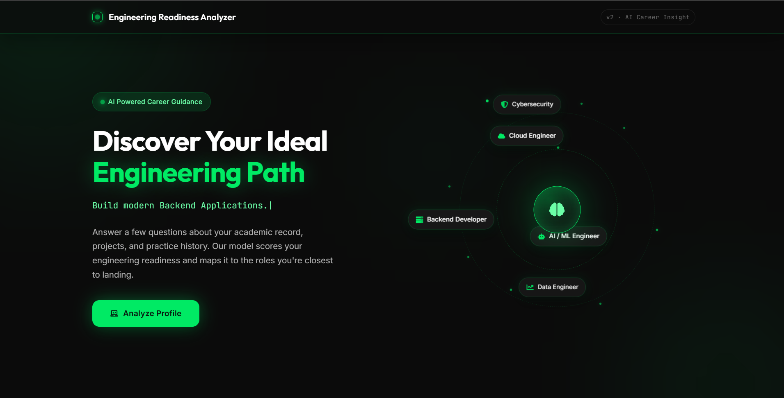
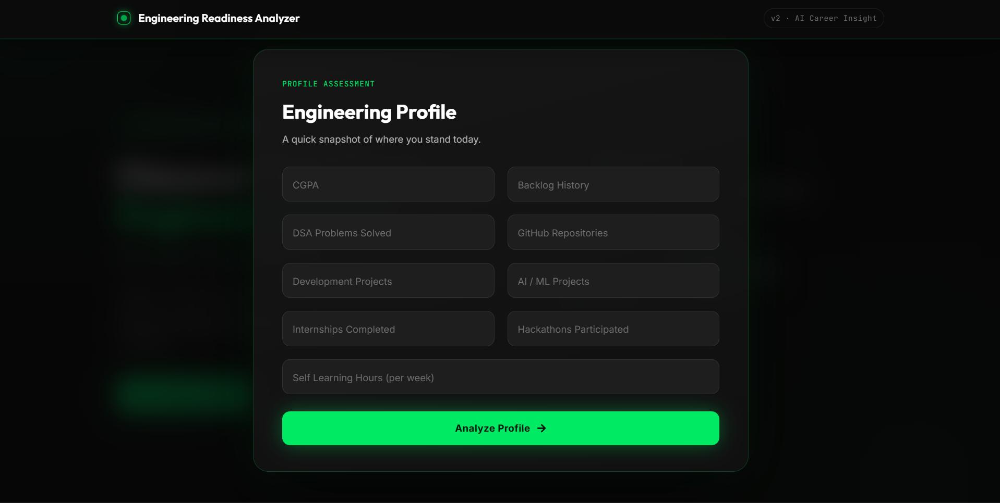
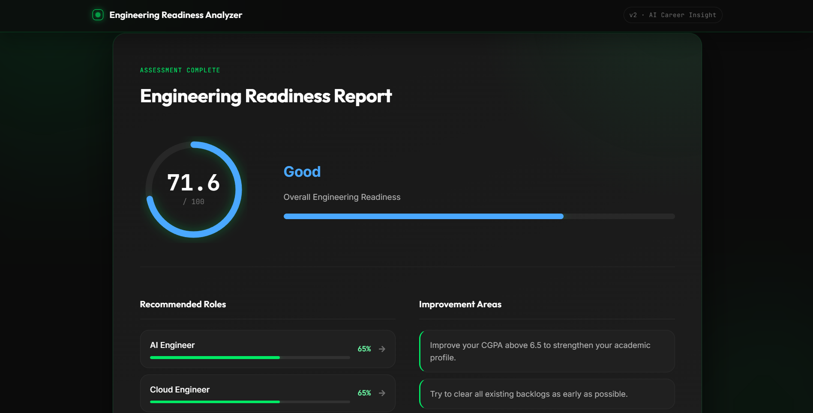
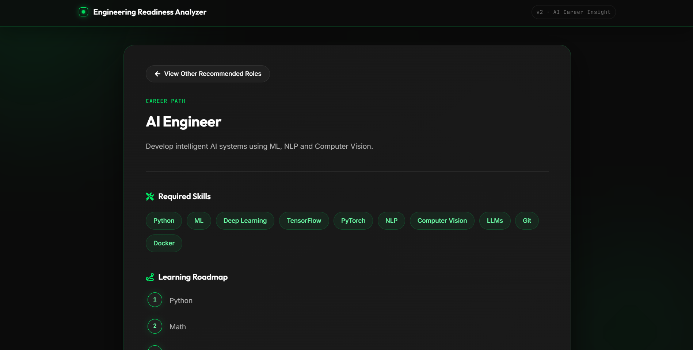

# 🚀 Engineering Readiness Assessment System

An AI-powered full-stack web application that evaluates an engineering student's readiness for the software industry using Machine Learning and recommends suitable career paths with personalized learning roadmaps.

---

## 🌐 Live Demo

- **Frontend:** https://engineering-readiness-assessment-sy.vercel.app/
- **Backend:** https://engineering-readiness-assessment-system.onrender.com/

---

## 📖 Overview

Engineering Readiness Assessment System helps students assess their technical preparedness for software engineering roles by analyzing academic performance, coding experience, projects, internships, hackathons, and self-learning habits.

The application predicts an **Engineering Readiness Score (0–100)** using a Machine Learning model and recommends the most suitable engineering roles along with detailed career roadmaps, learning resources, and improvement suggestions.

---

## ✨ Features

- 🤖 Machine Learning based Engineering Readiness Prediction
- 📊 Engineering Readiness Score (0–100)
- 🎯 Personalized Engineering Role Recommendations
- 📚 Detailed Role Information
- 🛣️ Career Roadmaps
- 🎥 Curated YouTube Learning Resources
- 📖 Recommended Courses
- 💻 Coding Practice Platforms
- 💡 Project Suggestions
- 🏢 Top Hiring Companies
- 💰 Salary Insights
- 📱 Responsive User Interface
- ⚡ Smooth Animations with Framer Motion

---

## 🖼️ Screenshots

### Home Page



### Assessment Form



### Prediction Result



### Role Details



---

## 🛠️ Tech Stack

### Frontend

- React
- Vite
- CSS3
- Axios
- Framer Motion
- React Icons

### Backend

- Flask
- Flask-CORS
- Gunicorn

### Machine Learning

- Python
- Scikit-learn
- Pandas
- NumPy
- Joblib

### Deployment

- Vercel (Frontend)
- Render (Backend)

### Development Tools

- Git
- GitHub
- VS Code

---

## 📂 Project Structure

```text
Engineering-Readiness-Assessment-System/
│
├── frontend/
│   ├── src/
│   ├── public/
│   ├── package.json
│   └── .env
│
├── backend/
│   ├── app.py
│   ├── predict.py
│   ├── role_data.json
│   ├── requirements.txt
│   ├── model/
│   │   └── engineering_score_model.pkl
│   └── dataset/
│
├── screenshots/
│
└── README.md
```

---

## ⚙️ Machine Learning

The application compares multiple regression models to predict Engineering Readiness Score.

### Models Evaluated

- Linear Regression
- Decision Tree Regressor
- Random Forest Regressor ✅
- XGBoost Regressor

### Final Model

**Random Forest Regressor**

### Performance

| Metric | Score |
|---------|------:|
| R² Score | 0.593 |
| RMSE | 9.45 |
| MAE | 7.07 |

---

## 📊 Prediction Features

The Machine Learning model uses the following inputs:

- CGPA
- Backlog History
- DSA Problems Solved
- GitHub Repositories
- Development Projects
- AI/ML Projects
- Internships Completed
- Hackathons Participated
- Self Learning Hours

---

## 🎯 Supported Career Roles

- Software Engineer
- Backend Developer
- Full Stack Developer
- Machine Learning Engineer
- AI Engineer
- Data Scientist
- Cloud Engineer
- DevOps Engineer
- Cybersecurity Analyst
- Mobile Application Developer

---

## 🚀 Installation

### Clone the Repository

```bash
git clone https://github.com/Srd-Saqhib/engineering-readiness-assessment-system.git
cd engineering-readiness-assessment-system
```

### Frontend

Create a `.env` file inside the `frontend` folder:

```env
VITE_API_URL=http://127.0.0.1:5000
```

Run the frontend:

```bash
cd frontend
npm install
npm run dev
```

### Backend

```bash
cd backend
pip install -r requirements.txt
python app.py
```

---

## 🌐 API Endpoints

### Predict Engineering Readiness

```http
POST /predict
```

Returns:

- Engineering Readiness Score
- Readiness Level
- Recommended Roles
- Personalized Suggestions

---

### Get Role Details

```http
GET /role/<role_name>
```

Returns:

- Role Overview
- Required Skills
- Learning Roadmap
- YouTube Resources
- Recommended Courses
- Coding Platforms
- Project Ideas
- Top Hiring Companies
- Salary Insights

---

## 📈 Application Workflow

```text
Student Input
      │
      ▼
Data Validation
      │
      ▼
Random Forest Regression Model
      │
      ▼
Engineering Readiness Score
      │
      ▼
Role Recommendation Engine
      │
      ▼
Detailed Career Guidance
```

---

## 🚀 Deployment

The application is deployed using:

- **Frontend:** Vercel
- **Backend:** Render

The frontend communicates with the backend using the `VITE_API_URL` environment variable, allowing different API endpoints for local development and production.

---

## 🔮 Future Enhancements

- User Authentication
- Student Dashboard
- Assessment History
- Resume Analysis
- AI Career Assistant
- Interview Question Generator
- Skill Gap Analysis
- Course Progress Tracking
- Placement Prediction
- Resume PDF Export

---

## 👨‍💻 Author

**Saqhib**

Computer Science Engineering Student

GitHub: https://github.com/Srd-Saqhib

---

## 📜 License

This project is intended for educational and learning purposes.

---

## ⭐ Support

If you found this project helpful, consider giving it a ⭐ on GitHub.